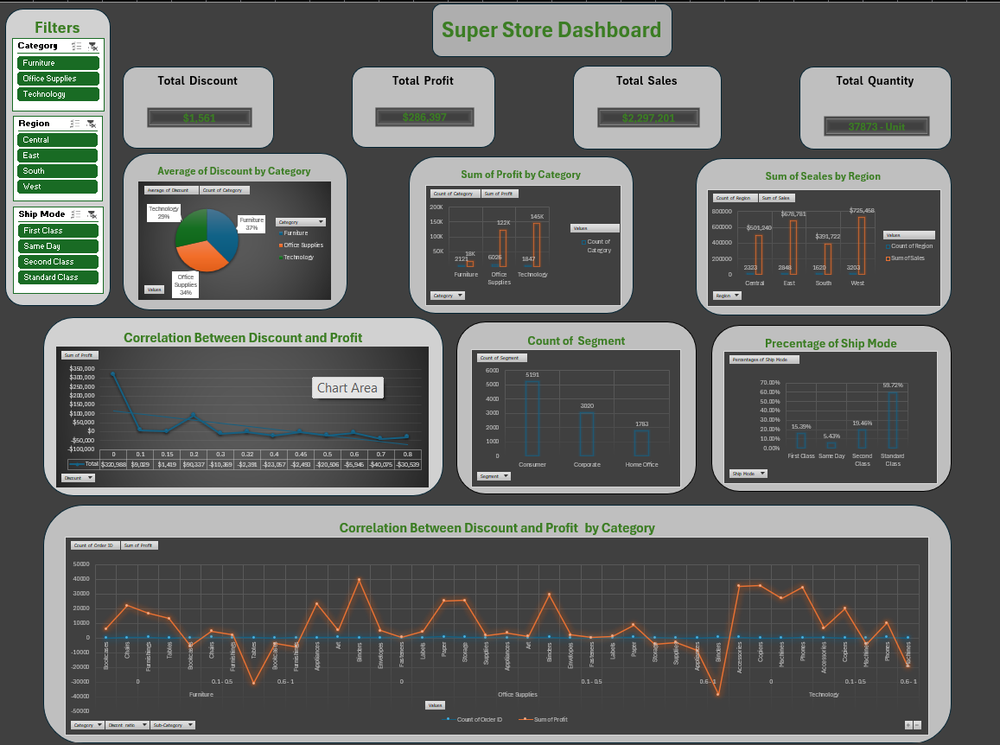

# 📊 Superstore Sales Dashboard (Excel)

An interactive sales dashboard built entirely in **Microsoft Excel** to analyze retail sales performance and generate business insights.

The project demonstrates data cleaning, analysis, dashboard design, and business reporting using Excel features such as PivotTables, PivotCharts, Slicers, and KPI cards.

---

# 📌 Project Overview

This project analyzes retail sales data from the Sample Superstore dataset to evaluate sales performance, profitability, customer behavior, and regional trends.

---

# 🛠 Technologies Used

- Microsoft Excel
- PivotTables
- PivotCharts
- Slicers
- Conditional Formatting

---

# 📂 Dataset

The dataset includes information about:

- Orders
- Customers
- Products
- Categories
- Regions
- Sales
- Profit
- Discounts

---

# ⚙️ Project Workflow

### Data Preparation

- Cleaned and organized the dataset.
- Verified data consistency.
- Prepared the data for analysis.

---

### Data Analysis

Performed analysis to evaluate:

- Sales Performance
- Profit Performance
- Customer Segments
- Product Categories
- Regional Performance

---

### Dashboard Development

Built an interactive Excel dashboard featuring:

- KPI Cards
- PivotTables
- PivotCharts
- Slicers
- Dynamic Reports

---

# 📊 Dashboard Features

✔ Total Sales

✔ Total Profit

✔ Regional Performance

✔ Product Analysis

✔ Customer Segment Analysis

✔ Interactive Slicers

✔ KPI Summary

---

# 📷 Dashboard Preview



---

# 📈 Key Insights

- Identified top-performing product categories.
- Compared sales and profit across regions.
- Evaluated customer segment performance.
- Monitored overall business performance using interactive KPIs.

---

# 🚀 Skills Demonstrated

- Microsoft Excel
- Data Cleaning
- Data Analysis
- PivotTables
- PivotCharts
- Dashboard Design
- KPI Reporting
- Business Analytics
- Data Visualization

---

# 📁 Repository Structure

```
Superstore-Sales-Dashboard
│
├── README.md
├── data
│   └── Sample-Superstore.xlsx
│
└── images
    └── dashboard.png
```

---

# 👤 Author

**Mohamed Gamal**

- GitHub: https://github.com/mo7amedgamal2
- LinkedIn: https://www.linkedin.com/in/mohamed-gamal-eldeen/
